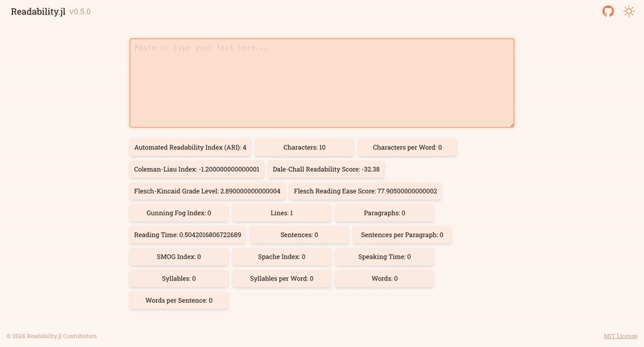

<div>
<a href="https://github.com/cecoeco/Readability.jl/actions/workflows/CI.yml"></a>
<a href="https://cecoeco.github.io/Readability.jl/stable/"></a> 
<a href="https://cecoeco.github.io/Readability.jl/dev/"></a>
<a href="https://juliapkgstats.com/pkg/Readability"></a>
<a href="https://github.com/JuliaDiff/BlueStyle"></a>

</div>

# Readability.jl

Julia package that analyzes the difficulty of texts using different indexes like Gunning-Fog, SMOG, and Flesch-Kincaid.

## Installation

use this command in the Julia REPL:

```julia
using Pkg; Pkg.add("Readability")
```

## Web App

The `Readability.jl` package can be used without ever having to program via a [web application](https://readability-jl.onrender.com) written in [`React.js`](https://react.dev/) and [`Oxygen.jl`](https://github.com/OxygenFramework/Oxygen.jl)

